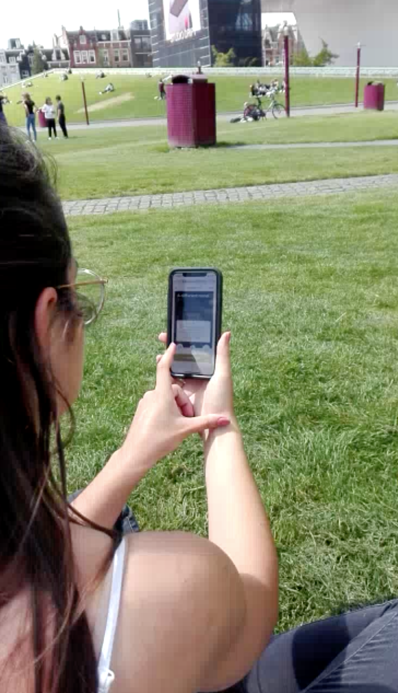
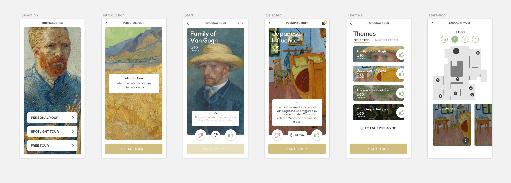

# Masterpiece - van Gogh
This project is about improving the multimedia tour, which I did  
together with Fenna de Wilde for the Van Gogh Museum.  
`This` was a 5 week assignment with the end result of a personal media tour.

Our section consists of creating a design and an interface for the user that wants to do the personal tour.

__Assignment description__:  
Develop an interface that allows visitors of the Van Gogh museum to visit  
(with multimedia tour) by choosing different themes and presenting the results.

__Final concept__:  
By swiping on the on the interface the user can make decisions to  
create his/her own tour. The decisions are based on the theme's  
within the museum. When they start the tour, the map will  
guide the user to his or her themes and paintings. 

[The App](https://sam-guliker.github.io/minor-vangogh/)  


# Table of Content
* [Getting started](#getting-started)
* [Introduction](#introduction)
* [Dependencies](#dependencies)
* [Features](#features)
* [Learning Goals](#learning-goals)
* [Worklflow](#workflow)
* [User Scenario](#user-scenario)
* [Important to mention](#important-to-mention)
* [Wishlist](#wishlist)
* [License](#license)

# Getting Started
How to get started with this project:
1.  Clone the repo with `git clone https://github.com/Sam-Guliker/minor-vangogh` or download it from github
2.  Run `npm install` or `yarn` to install the dependencies
3.  Run `npm run dev` to start the server
4.  Go to [http://localhost:3000/](http://localhost:3000/)

# Introduction
__Assignment description__:  
Develop an interface that allows visitors to the museum to visit  (with multimedia tour) by choosing different themes and presenting the results


__Final concept__:  
By swiping on the on the interface the user can make decisions to
create his/her own tour. The decisions are based on the theme's within the museum. When they start the tour, the map will guide the user to his or her themes and paintings. 

# Dependencies
*   [x] ReactJS
*   [x] Service Worker
*   [x] GZIP
*   [x] SASS
*   [x] ESLinter
*   [x] Prettier
*   [x] Minify Uglify
*   [x] GSAP
*   [x] Gulp

# Features
- User can make his/her own decisions
- The user can walk the tour (partial)
- Offline availabiliy

# Learning goals
My main learning goal is to improve __web app from sratch(wafs)__, by working with
_react_ there are alot of code-confensions that are in the same way as OOP.

__Webdesign__
In this subject I wanted to focus on user how you can improve the flow in the app, we did this by A and B testing and testing on the museum square.

Important findings and adjustments have been made through testing, which will be discussed later in this document.

__Css to the rescue__
Using the sass [way](https://sass-lang.com/).

__Realtime web__
Met ons eerste idee wilden we met beacons werken en mensen in een ruimte meten. Dit wilden we met real-time-data doen. Helaas ging dit niet door omdat de opdrachtgever niet geintreseerd was 

__Teamwork__
Within the collaboration we wanted to have code that we can all read we did this by adding a linter. By coincidence we also encountered prettier, this makes sure that when you forget something like a space or semi colon this is automatically fixes itself. With this combination we have created a good workflow within the team.

<details>

<summary>Eslinter</summary>

```javascript

  module.exports = {
  extends: ["standard", "eslint:recommended", "plugin:react/recommended"],
  settings: {
    react: {
      createClass: "createReactClass", 
      pragma: "React",
      version: "15.0",
      flowVersion: "0.53"
    },
    propWrapperFunctions: ["forbidExtraProps"]
  },
  parserOptions: {
    ecmaFeatures: {
      jsx: true
    }
  }
};
```

</details>

# Users
The avarage age of the visitors of the Van Gogh museum is 31.  
50% from their users are between 18-30 years old. The museum is very populair among tourists. 
They have visitors from all over the world. 

# User Scenario
<b>User scenario personalisation</b><br>
Ryan arrives at the gogh museum. This was an impulsive idea. He doesn't feel like seeing everything and spending hours in the museum. However, he would like to have some more information about the paintings, so he gets a device for the mutimedia tour. He wants to find a suitable tour quickly with interesting topics that won't take too long.

<b>User scenario tour</b><br>
Fransisco & Dafne are from Italy. They go to the van gogh museum to admire his work. They want to participate in the multimedia tour. They pick up a device at the desk and start the personalization tour. After selecting all themes, they start the tour. On the screen they see their position on the map. The map also shows the first painting of the tour. They know where to go to find the painting.

# Testing

## Protoype B

You can find my prototype in the branch questionnaire.
In this prototype I wanted to make my app more modulair :eyes:
this is component-based and falls under my learning goals


<details>
<summary>Modulair</summary>

```javascript
import React, { Component } from "react";
import { Route, Switch, BrowserRouter as Router } from "react-router-dom";

import Home from "./components/Home";
import Header from "./components/Header";
import NotFound from "./components/NotFound";

import LifeStart from "./components/LifeStart";
import Brain from "./components/Brain";
import Personal from "./components/Personal";
import LastYears from "./components/LastYears";
import Time from "./components/Time";
import Overview from "./components/Overview";
import Finished from "./components/Finished";

const App = props => (
  <div className="app">
    <main>
      <Router>
        <Switch>
          <Route exact path="/" component={Home} />
          <Route path="/lifestart" component={LifeStart} />
          <Route path="/brain" component={Brain} />
          <Route path="/personal" component={Personal} />
          <Route path="/lastYears" component={LastYears} />
          <Route path="/time" component={Time} />
          <Route path="/overview" component={Overview} />
          <Route path="/finished" component={Finished} />
          <Route component={NotFound} />
        </Switch>
      </Router>
    </main>
  </div>
);

export default App;
```

</details>

## A/B Usability test classmates
We both made a prototype. Fenna made prototype A and Sam prototype B. Prototype B was questionnaire. After the questionaire the tour was generated for you based on your answers.  With prototype A, you could view and add your own themes to the tour.

Findings
The following came out of the test results: 
- People who want to make a personalised tour take the time to do so
- The start button of prototype A was too clogged up
- People felt that the questionnaire was not personal and that it was vague
- People did not bother to go to the info page of the theme

Design Choices
From these test results we decided to make different elements of the prototypes and to make a nice fusion of them.

The user has to make a choice for each theme. He can do this to swip left or right. The info of the theme is on the same page instead of individually. The start button has been made clearer. Both prototypes also had a timer. We used the overview page of prototype A.

## Usability test museumplein
We tested the app with (real) people at museumplein. 

<b>Conclusions</b>  
1. On the text field the swipe function was removed because it also had a click function. However, all test persons tried to swip over the text field and therefore the swipe didn't succeed. 

    <b>Improvement: </b>We have made sure that you can also swipe over the text field

2. The test persons want to have more information about the themes.

    <b>Improvement: </b>We decided to leave the text field unfolded by default.  

3. The test subjects were not interested in the overview page this is because they are confident about the choices they made. This was the last step before they could start the tour. 

    <b>Improvement: </b>We now put the overview page in a menu item but left it out of the flow.  
 

Some pictures of the test  
<details>
<summary>Image 1</summary>


</details>
<details>
<summary>Image 2</summary>



</details>
<details>
<summary>Image 3</summary>


</details>

# Design
The design process has helped us a lot with the choices for the userflow.
After testing, we were able to make quick adjustments to the prototype.


# Important to mention
At the start of this project we wanted a frontend framework to connect with a backend.
This was so we could use beacons or any other sensor type and store data.

## Frontend
For the frontend we used [react](https://reactjs.org/), a powerfull framework to load in our data.

### Routing
For routing I used the reac-trouter-dom.

<details>

```javascript
import React from "react";
import { BrowserRouter as Router, Route } from "react-router-dom";
import "./index.css";
import registerServiceWorker from "./registerServiceWorker";

import App from "./App";
import AddItem from "./components/AddItem";
import IndexItem from "./components/IndexItem";
import EditItem from "./components/EditItem";

ReactDOM.render(
  <Router>
    <div>
      <Route exact path="/" component={App} />
      <Route path="/add-item" component={AddItem} />
      <Route path="/index" component={IndexItem} />
      <Route path="/edit/:id" component={EditItem} />
    </div>
  </Router>,
  document.getElementById("root")
);
registerServiceWorker();
```

</details>

### Adding data from the frontend
With this simple forum you can add data to the backend

<details>

``` javascript
import React, { Component } from "react";
import ItemService from "./ItemService";

class AddItem extends Component {
  constructor(props) {
    super(props);
    this.state = { value: "" };
    this.addItemService = new ItemService();

    this.handleChange = this.handleChange.bind(this);
    this.handleSubmit = this.handleSubmit.bind(this);
  }

  handleChange(event) {
    this.setState({ value: event.target.value });
  }

  handleSubmit(event) {
    event.preventDefault();
    this.addItemService.sendData(this.state.value);
    this.props.history.push("/index");
  }

  render() {
    return (
      <div className="container">
        <form onSubmit={this.handleSubmit}>
          <label>
            Add Item:
            <input
              type="text"
              value={this.state.value}
              onChange={this.handleChange}
              className="form-control"
            />
          </label>
          <br />
          <input type="submit" value="Submit" className="btn btn-primary" />
        </form>
      </div>
    );
  }
}

export default AddItem;
```

</details>

### Editing the data through frontend
With [axios]() I made a promise to catch the local host and this way you can edit an item.
<details>

```javascript
import React, { Component } from "react";
import { Link } from "react-router-dom";
import ItemService from "./ItemService";

class TableRow extends Component {
  constructor(props) {
    super(props);
    this.addItemService = new ItemService();
    this.handleSubmit = this.handleSubmit.bind(this);
  }

  handleSubmit(event) {
    event.preventDefault();
    this.addItemService.deleteData(this.props.obj._id);
  }
  render() {
    return (
      <tr>
        <td>{this.props.obj._id}</td>
        <td>{this.props.obj.item}</td>
        <td>
          <Link to={"/edit/" + this.props.obj._id} className="btn btn-primary">
            Edit
          </Link>
        </td>
        <td>
          <form onSubmit={this.handleSubmit}>
            <input type="submit" value="Delete" className="btn btn-danger" />
          </form>
        </td>
      </tr>
    );
  }
}

export default TableRow;
```

</details>

## Backend 
The backend part can be found [here](https://github.com/Sam-Guliker/minor-backend)

### Express setup
Its a simple server running [express](https://expressjs.com/), using [mongoose](https://www.npmjs.com/package/mongoose) for the Database.
Using [cors](https://www.npmjs.com/package/cors) as middleware to give access.
Using [dotenv](https://www.npmjs.com/package/dotenv) to make my app more secure.

<details>

```javascript

const express = require("express");
const app = express();
const port = 4200;
const mongoose = require("mongoose");
const bodyParser = require("body-parser");
const cors = require("cors");
const env = require("dotenv").config();

mongoose.Promise = require("bluebird");
mongoose
  .connect(process.env.DB_HOST)
  .then(() => {
    console.log("Start");
  })
  .catch(err => {
    console.error("App starting error:", err.stack);
    process.exit(1);
  });

// // Required application specific custom router module
const itemRouter = require("./src/routes/itemRouter");

// Use middlewares to set view engine and post json data to the server
app.use(express.static("public"));
app.use(cors());
app.use(bodyParser.urlencoded({ extended: true }));
app.use(bodyParser.json());

app.use("/items", itemRouter);

app.listen(port, function() {
  console.log(port);
});
```

</details>

### Mongoose schema
This was a simple model to check if I could edit items with a string name.

<details>

```javascript
const mongoose = require("mongoose");
const Schema = mongoose.Schema;

// Define collection and schema for Items
const Item = new Schema(
  {
    item: {
      type: String
    }
  },
  {
    collection: "items"
  }
);

module.exports = mongoose.model("Item", Item);
```

</details>

### Route and updates
Making sure the server is doing what the frontend wants it to do.

<details>

```javascript
const express = require("express");
const app = express();
const itemRouter = express.Router();

// Require Item model in our routes module
const Item = require("../models/Item");

// Defined store route
itemRouter.route("/add/post").post(function(req, res) {
  const item = new Item(req.body);
  item
    .save()
    .then(item => {
      res.json("Item added successfully");
    })
    .catch(err => {
      res.status(400).send("unable to save to database");
    });
});

// Defined get data(index or listing) route
itemRouter.route("/").get(function(req, res) {
  Item.find(function(err, itms) {
    if (err) {
      console.log(err);
    } else {
      res.json(itms);
    }
  });
});

// Defined edit route
itemRouter.route("/edit/:id").get(function(req, res) {
  const id = req.params.id;
  Item.findById(id, function(err, item) {
    res.json(item);
  });
});

//  Defined update route
itemRouter.route("/update/:id").post(function(req, res) {
  Item.findById(req.params.id, function(err, item) {
    if (!item) return next(new Error("Could not load Document"));
    else {
      // do your updates here
      item.item = req.body.item;

      item
        .save()
        .then(item => {
          res.json("Update complete");
        })
        .catch(err => {
          res.status(400).send("unable to update the database");
        });
    }
  });
});

// Defined delete | remove | destroy route
itemRouter.route("/delete/:id").get(function(req, res) {
  Item.findByIdAndRemove({ _id: req.params.id }, function(err, item) {
    if (err) res.json(err);
    else res.json("Successfully removed");
  });
})

module.exports = itemRouter;
```

</details>


# Wishlist
- [ ] When you swiped there will be a painting animation instead of a like or dislike icon
- [ ] Loader more into Van Gogh's theme
- [ ] More animations and smooth transitions
- [ ] Loader between the last step and the tour, for the userflow

# Sources 
* [Dotenv](https://www.npmjs.com/package/dotenv)
* [Mongoose](https://www.npmjs.com/package/mongoose)
* [Cors](https://www.npmjs.com/package/cors)
* [Axios](https://www.npmjs.com/package/axios)
* [Bluebird](http://bluebirdjs.com/docs/getting-started.html)
* [React](https://reactjs.org/)
* [Express](https://expressjs.com/)
* [Eslint](https://eslint.org/docs/user-guide/configuring)
* [Sass](https://sass-lang.com/)


# Lisence
Copyright © 2018 Sam Guliker & Fenna de Wilde.  
Released under the [MIT license](https://opensource.org/licenses/MIT)
